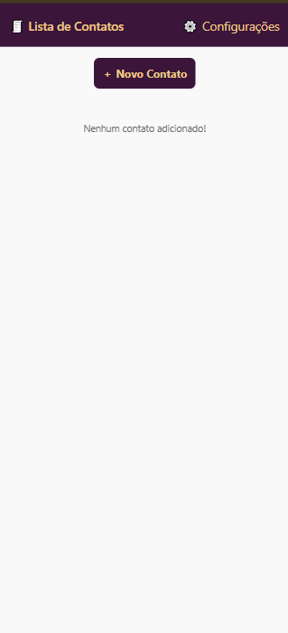
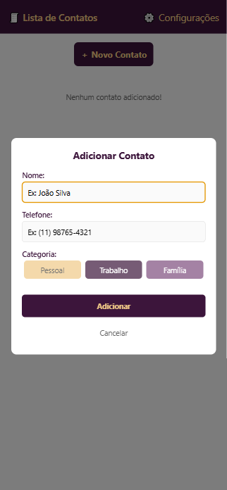
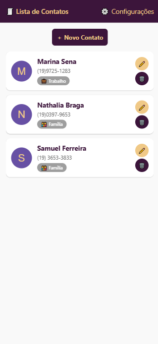
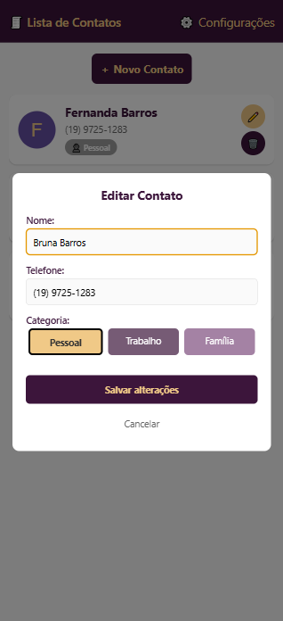
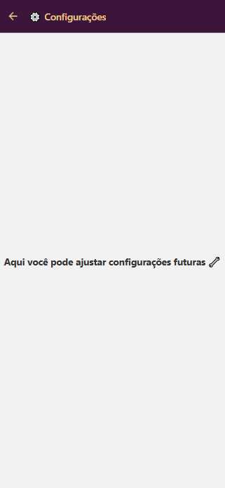

# Atividade: Desenvolvimento de App de Contatos

## Objetivo

Criar um aplicativo de contatos telefônicos usando React Native, Expo e React Native Paper, aplicando os conceitos que você aprendeu na aula do TaskMaster.

## Estrutura do projeto:

- **app/_layout.js** - Configure a navegação e o tema do Paper
- **app/index.js** - Lista de contatos e modal para adicionar/editar
- **app/settings.js** - Tela simples de configurações
- **components/ContactItem.js** - Componente para exibir cada contato

## Funcionalidades obrigatórias:

- Adicionar contatos com nome, telefone e categoria (trabalho/pessoal/família)
- Visualizar todos os contatos em uma lista
- Editar contatos existentes
- Excluir contatos com confirmação
  
## Tecnologias Utilizadas

- React Native
- Expo
- React Native Paper
- Expo Router

## Screenshots

- **Tela Principal**

- **Adicionar Contato**

- **Lista de Contatos**

- **Editar Contato**

- **Tela de Configurações**

## Instruções
1. Clone o repositório
2. Instale as dependências com `npm install`
3. Inicie o projeto com `npx expo start`
4. Abra o aplicativo no seu dispositivo ou emulador
5. Explore as funcionalidades de adicionar, editar e excluir contatos